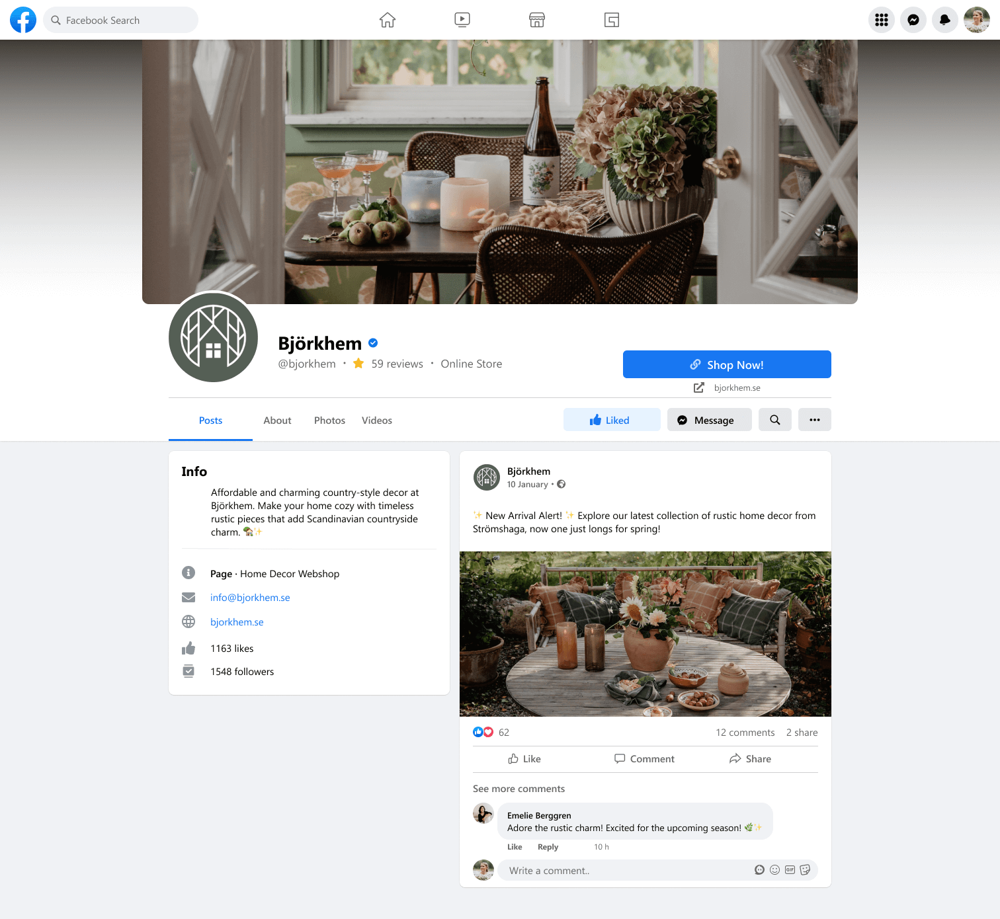

# Björkhem SEO and Marketing Research

:arrow_left: [Return to the README](README.md)

## Table of Contents

- [Keyword Research](#keyword-research)
- [Research of similar businesses](#research-of-similar-businesses)
- [SEO Improvements](#seo-improvements)
- [Marketing Strategies](#marketing-strategies)

# Keyword Research

**Keyword to research**

1.	Rustic Home Decor
2.  Scandinavian rustic interior 
3.	Affordable Country Style
4.	Nordic Home Accents
5.	Traditional Charm
6.	Budget-Friendly Elegance
7.	Interior Gifts
8.	Accessible Decor
9.	Timeless Home Decor

**Testing Keywords for volume and competition**

I used [Wordtracker](https://www.wordtracker.com/) to see how important and authoritative certain words are. I checked as many as I could for free. If it were a real online store, more effort would be dedicated to researching and optimizing keywords.

## Research of similar businesses

I found inspiration for Björkhem by exploring websites like [Country Interior](https://www.countryinterior.com/) and [Ängshem Inrederi](https://www.angsheminrederi.se/). These platforms offered valuable insights, helping me refine Björkhem's unique identity and strategy.

# SEO Improvements

**Meta tags**
Implemented meta tags in the head section of base.html for improved SEO, including `<meta name="description"...` and `<meta name="keywords"...` tags.

**Incorporated Keywords for Optimization**
Implemented key terms within product descriptions and image alt texts to enhance search visibility and improve user experience. This strategic integration aligns content with relevant searches, ensuring our products are easily discoverable.

**Creating a Sitemap**
Generated a `sitemap.xml` file using XML Sitemaps to enhance site navigation for search engines and accelerate content discovery.

**Creating a robots.txt file**
Developed a robots.txt file to guide search engines on which directories to exclude from crawling and indexing. Additionally, the file includes a link to the sitemap, signaling a level of quality to search engines and thereby improving SEO ranking.

# Marketing Strategies

Bjorkhem is a B2C business specializing in affordable and high-quality rustic Scandinavian interior design. We aim to offer aesthetically pleasing and functional products, creating an engaging online shopping experience for individual consumers.

Before finalizing marketing strategies and outlining a business plan, I explored the following questions to establish a foundation for the business strategy:

**1. What do your users need?**

- A clear understanding of the website's theme.
- A diverse range of products that is regularly updated.
- Convenient ways to subscribe, connect on social media, and get in touch with the store.

**2. What information and features can you provide to meet those needs?**

- Present a clear description of the website's theme on the homepage. 
- Include a section for news and a newsletter subscription option. 
- Add links to social media profiles and a contact section. 
- Provide a link to transparent policy information.

**3. How can you make the information easy to understand?**
- Use a clean and simple design.
- Utilize clear headlines and concise, informative text sections.
- Incorporate clear Call-to-Action buttons for subscription.

**4. How can you demonstrate expertise, authoritativeness, and trustworthiness in your content?**
- Include sections showcasing past achievements, customer reviews, and any industry expertise.
- Use professional images and clear descriptions of your offerings.

**5. Would there be other pages within your site you could link to from your chosen page?**
- Link to other relevant pages that provide more detailed information about your services, products, or previous projects.

**6. Are there opportunities to link back to external websites that already rank highly on Google?**
- If there are relevant and trustworthy external sources that complement your information, include links to them to enhance credibility.

**7. How can you help users discover other relevant parts of your web application?**
- Use clear navigation links to other key parts of your web application directly on the homepage.
- Employ recommended content sections to guide users to related pages.

## Strategies

**1. Target Audience Focus:**

- Identifying and serving a diverse audience, specifically those who appreciate affordable and scandinavian country-style home decor.

**2. Social Media Engagement:**

- Currently active on Facebook with a substantial following, regularly posting updates.
- In the process of establishing an Instagram account to reach a broader audience.

Björkhem is already engaging actively on Facebook, boasting a significant follower base and maintaining consistent posting. Additionally, efforts are underway to launch an Instagram account to extend reach to a wider target audience.

**3. Content Strategy:**

- Meeting user needs through engaging content, including posts, practical tips, and success stories on Facebook and Instagram.

**4. Promotions and Offers:**

- Running promotions and discounts as part of the business strategy, with communication through captivating posts on social media.

**5. Email Marketing:**

- Regularly sending out newsletters containing updates, tips, and other valuable information. Users can sign up via web forms.

**6. Business Goals and Marketing Strategies:**

- Outlining overarching goals such as expanding the collection, enhancing user experience, building an engaged community, maintaining product quality, and providing education and inspiration on Instagram and Facebook.
- Marketing strategies include regular social media updates, continuous website improvements, fostering community engagement, implementing effective email marketing.

**7. Balancing Advertising Budget:**

- Allocating a budget for advertising while also leveraging free or low-cost options.
- Emphasizing genuine community engagement and interaction as a commitment to providing a welcoming space.

In summary, the approach goes beyond product sales, aiming to establish a space where users can effortlessly discover, value, and incorporate rustic charm into their homes, emphasizing accessibility, quality, and community building.