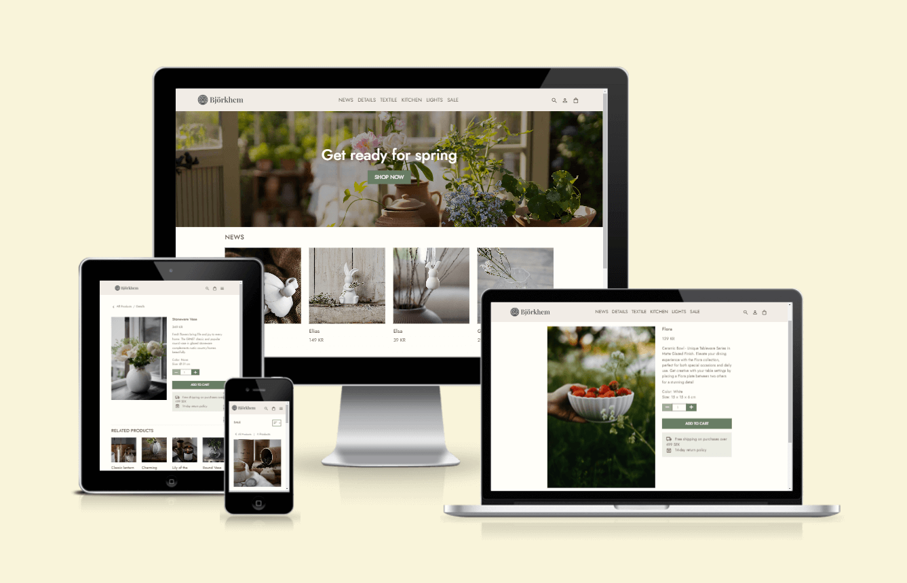

# Björkhem
Link to the website: [Björkhem](https://bjorkhem-8b5ef3ef81a6.herokuapp.com/)

## Table of Content

- [Björkhem](#björkhem)
  - [Table of Content](#table-of-content)
  - [About](#about)
  - [Project Goals](#project-goals)
  - [User Experience - UX](#user-experience---ux)
    - [Strategy](#strategy)
    - [Scope](#scope)
    - [Structure](#structure)
    - [Skeleton](#skeleton)
    - [Surface](#surface)
  - [SEO and Marketing](#seo-and-marketing)  
  - [Agile Development](#agile-development)
    - [Conclusion](#conclusion)
  - [Existing Features](#existing-features)
  - [Future Features](#future-features)
  - [Technologies Used](#technologies-used)
    - [Languages](#languages)
    - [Python Modules \& Packages](#python-modulespackages-used)
    - [Frameworks \& Tools](#frameworks--tools)
  - [Testing and Validation](#testing-and-validation)
  - [Deployment \& Development](#deployment--development)
  - [Credits](#credits)
    - [Media](#media)
    - [Code](#code)

## About

Welcome to Björkhem, your haven for Scandinavian country-style home treasures. Our handpicked collection infuses your space with rustic charm and comfort, ensuring your home reflects the simplicity and warmth of the Swedish countryside. At Björkhem, we embrace a down-to-earth approach, making it easy for you to bring a touch of cozy Swedish living to your abode. Roam through our webshop and let your home bask in the serenity of country-style living.

Björkhem is a B2C e-commerce platform that serves as your digital gateway to authentic Nordic living. Immerse yourself in a seamless shopping experience as you explore our curated product listings, discover exclusive discounts, bookmark your favorites, and stay updated with our delightful newsletter. At Björkhem, we're dedicated to bringing the heart of Scandinavian country-style living right to your doorstep.

## Project goals

The main goal of the webshop project is to create a super easy experience for customers to discover and purchase their favorite rustic Scandinavian country-style home decor. The platform provides a user-friendly space where people can effortlessly explore and acquire charming pieces that infuse the cozy vibes of the Swedish countryside into their homes.

Navigation through the webshop is designed to be straightforward, allowing users to enjoy exclusive discounts, bookmark their favorite items for future reference, and make purchases with ease. The focus is on simplicity and affordability, providing a welcoming space for everyone to easily bring a touch of comfy Swedish living into their spaces.

In essence, this project is more than just an online store; it's a digital destination where customers can easily find and purchase affordable and charming home treasures, capturing the essence of Scandinavian country-style living. The aim is to make it easy for individuals to shop and add that cozy Swedish feel to their homes.

## User Experience – UX

The application was created with a focus on the Five Planes of User Experience.

### Strategy

| Category                   | User Story                                                                                                   | Identifier |
|--------------------------- |--------------------------------------------------------------------------------------------------------------|------------|
| Viewing and Navigation     | As a shopper, I want to effortlessly navigate the website so that I can explore various home decor products.   | 1A         |
|                            | As a shopper, I want to view a list of products available for purchase so I can easily browse, compare, and decide what to buy. | 1B         |
|                            | As a shopper, I want to see specific details about a product so that I can make detailed purchase decisions.   | 1C         |
|                            | As a shopper, I want to easily see discounts and special offers so that I can benefit from cost savings.       | 1D         |
|                            | As a shopper, I want the website to work well on different devices so I can use it easily.                      | 1E         |
| Registration & User Accounts | As a site user, I want to easily register for an account using my email so that I can buy products.               | 2A         |
|                             | As a registered user, I want to access my order history and contact details so that I have control over my account information. | 2B         |
|                             | As a registered user, I want the ability to view a page featuring my favorite products so that I can quickly access and manage them. | 2C         |
|                             | As a registered user, I want to be able to permanently delete my account so that I can have control over my personal information and stop using the platform. | 2E         |
| Sorting & Searching         | As a shopper, I want to quickly find products by using keywords so that I can easily locate the product I'm searching for. | 3A         |
|                             | As a shopper, I want to easily refine my search using filters so that I can easily find what I'm looking for.     | 3B         |
| Purchasing and Checkout     | As a shopper, I want to add products to my cart easily so that I can review and confirm my selections before checkout. | 4A         |
|                             | As a shopper, I want a seamless and secure checkout process so that I can quickly and securely complete my purchases. | 4B         |
|                             | As a shopper, I want details about shipping costs so that I can make informed decisions and improve my overall shopping experience. | 4C         |
|                             | As a shopper, I want the option to review and edit my order details before confirming the purchase so that I can ensure my order is correct. | 4D         |
|                             | As a shopper, I want to receive an order confirmation so that I can have a record of my purchase.                | 4E         |
| Admin and Store Management  | As an admin, I want an easy process to add a product to the webshop so that I can efficiently manage the product catalog. | 5A         |
|                             | As an admin, I want the capability to edit or update product information so

#### Target Audience

The target audience includes individuals who appreciate Scandinavian country-style home decor, with a particular emphasis on those in Sweden. Catering to those who value the warmth and simplicity of rural Scandinavian design, the focus is on creating a welcoming space. The curated selection of home treasures captures the essence of cozy living, providing a diverse range of options for individuals seeking timeless pieces to enhance their homes. Whether you're setting up your first apartment or adding character to an existing space, embrace the beauty of Scandinavian country-style living, right here in Sweden.

#### Personas

**Persona: Sofia, 28**

**Background:**
- A 28-year-old professional residing in Stockholm, Sweden.
- Emma works in a creative field and values a cozy home environment.

**Interests:**
- Passionate about Scandinavian country-style home decor.
- Enjoys exploring vintage markets for unique pieces.

**Needs and Goals:**
- Seeks affordable and charming home decor reflecting a love for rustic design.
- Aims to create a stylish and welcoming home ambiance.

**Challenges:**
- Limited time due to a busy work schedule.
- Faces budget constraints as a young professional.

**How our Platform Helps:**
- Provides a user-friendly experience for easy browsing and product discovery.
- Offers a range of affordable, rustic decor items tailored to Emma's taste.
- Allows for the curation of favorite pieces and convenient access.

Considering Emma's preferences, our platform is designed to cater to individuals like her who appreciate Scandinavian country-style living. We aim to provide a seamless and budget-friendly shopping experience, ensuring the discovery of charming home treasures.

#### User Requirements and Expectations

## User Experience Expectations## User Experience Expectations

* Easy-to-use website with simple navigation.
* Access to all site functions without any hassle.
* Links and features work smoothly.
* Effortless and user-friendly shopping experience.
* Instant feedback when using the website's features.
* A nice-looking design that works well on different devices.
* Accessibility.

### Scope

1. **Intuitive Shopping Experience:**
- Ensure a easily navigable menu for straightforward product discovery.
- Verify that product names and categories accurately represent their content.
- Provide clear visual cues to guide users through the shopping process.
- Design each page with a layout that enhances the presentation of products.

2. **Relevant Product Information:**
- Include detailed information about each product, helping users make informed purchase decisions.
- Showcase featured products on the homepage to give visitors a snapshot of the webshop's offerings.

3. **Core E-Commerce Functions:**
- Develop essential features enabling smooth e-commerce interactions.
- Implement user registration, login, and logout functionalities for a personalized shopping experience.
- Create an efficient product addition form for seamless inventory management.
- Enable features allowing users to manage their shopping carts and track order history.

4. **Search Functionality:**
- Integrate a robust search feature, allowing users to quickly find products based on keywords.

5. **Wishlist Feature:**
- Implement a wishlist functionality, allowing users to save and track products they wish to purchase in the future.
  
6. **Secure Payment Processing:**
- Implement secure and reliable payment gateways to ensure the safety of user transactions.

7. **Responsive Design:**
- Ensure the webshop functions flawlessly on desktops, tablets, and mobile devices.
- Prioritize a responsive design to guarantee a seamless shopping experience across various devices and screen sizes.

### Skeleton

#### Current/Initial Structure

1. **Homepage:**
  - Display featured products for a quick introduction to the webshop's offerings.
  - Provide clear navigation to product categories.

2. **Product Pages:**
  - Organize products within relevant categories.
  - Ensure each product page includes detailed information, pricing, and clear calls-to-action.

3. **User Account Section:**
  - Implement user registration, login, and logout functionalities.
  - Enable users to manage their personal information and track order history.
  - Store favorite products on a dedicated page.

4. **Shopping Cart:**
  - Develop a functional shopping cart for users to review and manage selected items.
  - Implement a seamless checkout process.

6. **Community Engagement:**
  - Provide links to social media platforms for community interaction.
  - Add a newsletter signup form.

7. **Contact, About and FAQ:**
  - Include contact information.
  - Include information about the webshop's mission, values, and commitment to quality.
  - Explore our Frequently Asked Questions (FAQs) section for quick answers to common queries and helpful information.

#### Wireframes

I used Figma to design wireframes, which helped me to create a visual representation of the webshop.

1. **Home page**
2.	**Product page**
3. **User account section**
4. **Favorite product page**
5. **Shopping cart**
6. **Login/Sign up page**
7. **Contact, about and FAQ**

### Surface

#### Data Base Design
The Entity Relationship Diagram (ERD) shows how the database is organized at the heart of the site's features.

#### Colours
I aimed to establish a warm and inviting ambiance, opting for earthy tones and subtly muted colors.

#### Typography
I selected the Jost font to improve the visual appeal and readability of the webshop. The aim was to create a text style that is both pleasant and easy to read, harmonizing seamlessly with the overall design.

#### Logo
I created a simple logo for Björhem to strengthen its visual identity. The logo is minimalistic and easy to understand, making it easier for users to recognize and associate with Björkhem.

## SEO and Marketing
The SEO and Marketing documentation can be found at [MARKETING.md](MARKETING.md).

## Agile Development
The development of this project was managed through GitHub issues, milestones, and projects.
[Link to Björkhem User Stories](https://github.com/users/cardan22/projects/5)

### Sprints

## Conclusion

## Features

### Existing Features

## Future Features

## Technologies Used

### Languages

* [HTML](https://en.wikipedia.org/wiki/HTML)
* [CSS](https://en.wikipedia.org/wiki/Cascading_Style_Sheets)
* [JavaScript](https://en.wikipedia.org/wiki/Javascript)
* [Python](https://en.wikipedia.org/wiki/Python_%28programming_language%29)

### Python Modules/Packages used

* **Django:** A high-level Python web framework that served as the foundation for building this application/site.
* ***Psycopg2:**  This package acts as a PostgreSQL database adapter for Python, enabling seamless interaction with the database.
* **boto3:** A Python library that provides an interface to Amazon Web Services (AWS), allowing seamless integration with AWS services.
* **botocore:** A Python library that provides low-level, core functionality for AWS services.
* **dj-database-url:** A Django utility for parsing database connection URLs.
* **django-storages:** A Django library to manage storage backends like Amazon S3 and others.
* **django-allauth:** It's a comprehensive suite of Django applications that addresses various aspects of user authentication, registration, account management, and third-party (social) account authentication.
* **django-crispy-forms:** This package enhances the rendering of Django forms, offering more control and elegance in form presentation.
* **crispy-bootstrap4:** It's a template pack for django-crispy-forms that is tailored for use with Bootstrap 4, further improving the presentation of forms.
* **pillow:** A powerful Python imaging library that adds support for opening, manipulating, and saving many different image file formats.
* **gunicorn:** A Python WSGI HTTP Server for UNIX, used to serve the Django application.
* **asgiref:** ASGI specification reference implementation, used for handling asynchronous requests in Django.
* **jmespath:** Used for querying JSON-like data structures.
* **oauthlib:** Provides support for OAuth1 and OAuth2.
* **PyJWT:** Enables working with JSON Web Tokens (JWT).
* **python3-openid:** A set of Python packages to support the use of the OpenID decentralized identity system.
* **requests-oauthlib:** A OAuthlib extension to work with requests.
* **s3transfer:** Used for managing Amazon S3 transfers.
* **sqlparse:** A non-validating SQL parser.
* **stripe:** A Python library for interacting with the Stripe API.
* **urllib3:** A powerful HTTP client for Python.
* **coverage:** Measures code coverage during test execution.

### Frameworks & Tools

* **Django:** Utilized for building the website's backend logic and user model.
* **Gitpod:** Used for writing, developing, committing, and pushing code to the GitHub repository.
* **Heroku:** Employed for deploying the live version of the website.
* **GitHub:** Hosts the website's source code and serves as a platform for Agile development framework management through issues, milestones, and projects.
* **Bootstrap:** Applied across the site to ensure responsiveness, establish layout, and utilize predefined style elements.
* **Figma:** Utilized for creating wireframes and project design.
* **drawSQL:** Employed for designing the Entity-Relationship Diagram (ERD).
* **Google Fonts & Icons:** Imported custom fonts and integrated some icons into the website's design and functionality.

## Testing and Validation
The testing documentation can be found at [TESTING.md](TESTING.md)

## Deployment & Development

### Deploy on Heroku

**To deploy your project on Heroku, follow these steps:**

**Step 1: Preparing Files**

Before you start, you need two essential files: `requirements.txt` and `Procfile`.

- Create `requirements.txt` by running this command in your terminal: `pip3 freeze --local > requirements.txt`. This file will list all the requirements.
- Next, create a file named `Procfile` and add the line: `web: gunicorn pastryhub.wsgi` to it, without any empty lines. Make sure to push both these files to your repository.

**Step 2: Creating a Heroku App**

- Log in to Heroku and go to the Dashboard.
- Click "New" and select "Create new app."
- Give your app a name and choose the region closest to you.
- Click "Create app" to confirm.

**Step 3: Setting Up a Database**

- Log in to ElephantSQL.com and access your dashboard.
- Click "Create New Instance."
- Choose a plan, give it a name, select the Tiny Turtel (Free) plan, and leave the Tags field blank.
- Select a data center near you.
- Click "Review" and confirm your details.
- Return to the ElephantSQL dashboard and click on the database instance name for your project.
- In the URL section, copy the database URL.
- Ensure that Django and Gunicorn are installed in your workspace using `pip3 install 'django<4' gunicorn`.
- Also, make sure the database infrastructure is installed by running `pip3 install dj_database_url===0.5.0 psycopg2`.
- Ensure that the PostgreSQL adapter is installed by running `pip3 install psycopg2-binary`.
- Update the `requirements.txt` file if necessary.

**Step 4: The env.py File**

- Create an `env.py` file if you don't already have one and make sure it's included in the .gitignore file.
In the `env.py` file, add the following lines:

`import os`  
`os.environ["DATABASE_URL"] = "<copied URL from SQL database>"`  
`os.environ["SECRET_KEY"] = "<create a secret key of your own>"`  

Ensure that the environment variables are correctly imported into the `settings.py` file.

**Step 5: Configuring S3 Storage for Media Files**

- If you haven't already, sign up for an Amazon S3 account.
- Create a new S3 bucket for storing your media files.
- Obtain your AWS access key and secret key.
- In your `env.py` file, add the following lines:
* `os.environ["AWS_ACCESS_KEY_ID"] = "<your AWS access key>"`
* `os.environ["AWS_SECRET_ACCESS_KEY"] = "<your AWS secret key>"`

- Update your `settings.py` file to use S3 storage for media files. Install the required package:
- `pip install django-storages==1.14.2`

- Add the following configuration to `settings.py`:
* `AWS_STORAGE_BUCKET_NAME = '< bucket namne>'`
* `AWS_S3_REGION_NAME = '<region name>'`
* `AWS_ACCESS_KEY_ID = os.environ.get('AWS_ACCESS_KEY_ID')`
* `AWS_SECRET_ACCESS_KEY = os.environ.get('AWS_SECRET_ACCESS_KEY')`
* `AWS_S3_CUSTOM_DOMAIN = f'{AWS_STORAGE_BUCKET_NAME}.s3.amazonaws.com'`

Update the `MEDIA_URL` and `DEFAULT_FILE_STORAGE`:
* `MEDIA_URL = f'https://{AWS_S3_CUSTOM_DOMAIN}/'`
* `DEFAULT_FILE_STORAGE = 'storages.backends.s3boto3.S3Boto3Storage'`

**Step 6: Setting Up Stripe for Payment Processing**

- Log in to your Stripe Dashboard or create an account if you don't have one.
- In the dashboard, navigate to "Developers" > "API keys."
- Copy the "Publishable key" and "Secret key."
- Open your `env.py` file and add the following lines:
* `os.environ["STRIPE_PUBLIC_KEY"] = "<your Stripe Publishable key>"`
* `os.environ["STRIPE_SECRET_KEY"] = "<your Stripe Secret key>"`
* `os.environ["STRIPE_WH_SECRET"] = "<your Stripe Webhook Secret key>"`
- Make sure to include the `STRIPE_PUBLIC_KEY` and `STRIPE_SECRET_KEY` in your `settings.py` file.
- Install required package:
* `pip3 install stripe==7.10.0`
- Update the `requirements.txt` file by using `pip freeze > requirements.txt`

**Step 7: Setting Environment Variables on Heroku**

- On the Heroku Dashboard, select the app you created and then go to the "Settings" tab.
- Click "Reveal Config Vars."
- Add the following config vars:
* `DATABASE_URL` (copy the database URL from ElephantSQL).
* `SECRET_KEY` (copy your secret key).
* `AWS_ACCESS_KEY_ID` (copy your secret key).
* `AWS_SECRET_ACCESS_KEY` (copy your secret key).
* `STRIPE_PUBLIC_KEY`(copy your key).
* `STRIPE_SECRET_KEY`(copy your secret key).
* `STRIPE_WH_SECRET` (copy your secret key).

**Step 8: Connecting to GitHub and Deployment**

- On the Heroku Dashboard, select your app and go to the "Deploy" tab.
- Choose GitHub as the deployment method.
- Search for your project repository and click "Connect."
- If desired, enable automatic deploys.
- Finally, select "Deploy Branch" to watch your app being built and deployed.

### Forking the Repository

- Log in to GitHub and find the repository you want to fork.
- Above the "Settings" Tab, click the "Fork" button.
- You now have a copy of the original repository in your GitHub account, allowing you to make changes while keeping the original safe.

### Making a Local Clone

- Log in to GitHub and locate the repository you want to clone.
- Click the 'Code' dropdown above the file list.
- Copy the URL for the repository.
- Open Git Bash in your IDE.
- Change the current working directory to where you want the cloned directory.
- Type `git clone` in the CLI and then paste the URL you copied. It should look like this: `$ git clone https://github.com/yourusername/yourrepository`
- Press Enter to create your local clone.
- Don't forget to install all the required packages listed in the requirements.txt file using the command: `pip install -r requirements.txt`. This command will install them for you.

**Link to:** [Bjorkhem Repository](https://github.com/cardan22/bjorkhem)

## Credits

### Media

**Images:**

* [Hero Image ](https://www.flickr.com/photos/147283126@N07/52960973427/in/album-72177720308927262/)

* [404 Page Image](https://www.flickr.com/photos/147283126@N07/53383809279/in/album-72177720313229957/)

Facebook page:

* [Facebook background](https://www.flickr.com/photos/147283126@N07/52401695601/in/album-72177720299753640/)
* [Facebook Profile Picture](https://unsplash.com/photos/woman-in-black-long-sleeve-shirt-sitting-on-white-couch-n1B6ftPB5Eg)
* [Mockup](https://www.figma.com/community/file/1136232663200778614)
* [Facebook post](https://www.flickr.com/photos/147283126@N07/53234324170/in/album-72177720309082098/)

Product Images:

* [Angshult 2](https://www.storefactory.se/en/product/angshult-2/)
* [Ektorp](https://www.storefactory.se/en/product/ektorp/)
* [Elsa](https://www.storefactory.se/en/product/elsa/)
* [Flora 12](https://www.storefactory.se/en/product/flora-12/)
* [Lundby](https://www.storefactory.se/en/product/lundby/)
* [Candle Holder](https://ernstform.se/wp-content/uploads/2023/08/ernstform.se-candle-holder-ernstaw2023.37-scaled.jpg)
* [Apron](https://ernstform.se/wp-content/uploads/2023/08/ernstform.se-apron-dsc09925-scaled.jpg)
* [Candle Holder](https://ernstform.se/wp-content/uploads/2023/08/ernstform.se-candle-holder-ernstaw2023.6-scaled.jpg)
* [Textiles](https://ernstform.se/products/textiles/117430/)
* [Pot](https://ernstform.se/wp-content/uploads/2019/08/ernstform.se-pot-ernsthost2019.32.jpg)
* [Vases & Pots](https://ernstform.se/products/vases-pots/270751/)
* [Candles & Candle Holders](https://ernstform.se/products/candles-candle-holders/350125/)
* [Round Vase](https://ernstform.se/wp-content/uploads/2017/05/ErnstRoundVase.jpg)
* [Candle Holders](https://ernstform.se/products/candles-candle-holders/ektl53/)
* [Candle Holder](https://ernstform.se/wp-content/uploads/2023/08/ernstform.se-candle-holder-ernstaw2023.37-scaled.jpg)
* [Cushions](https://ernstform.se/products/cushions/111731/)
* [Cushion Cover](https://ernstform.se/wp-content/uploads/2021/12/ernstform.se-cushion-cover-ernstvar2022.18.1-scaled.jpg)
* [Cushion Cover](https://ernstform.se/wp-content/uploads/2022/11/ernstform.se-cushion-cover-ernstss2023.16-scaled.jpg)
* [Kitchen](https://ernstform.se/products/kitchen/245010/)
* [Kitchen](https://ernstform.se/products/kitchen/246016/)
* [Vase](https://ernstform.se/wp-content/uploads/2021/08/ernstform.se-vase-ernstaw2021.9-scaled.jpg)
* [Inspiration](https://ernstform.se/wp-content/uploads/2022/02/ernstform.se-inspiration-te2-scaled.jpg)

### Code

I drew resources and inspiration from a few different places:
- Reviewed Code Institute's 'I Think Therefore I Blog' and 'Boutique Ado' walkthrough project as references to start the coding process

- Some previous projects were helpful:
  - [earthalchemy-naturals](https://github.com/Lilla-Kavecsanszki/EarthAlchemyNaturals/tree/main) by Lilla Kavecsanszki
  - [chirpy-chooks](https://github.com/Kay-ddggxh/chirpy_chooks) by Kay-ddggxh

- During the project, I frequently visited the following websites for troubleshooting and assistance:
  - [Stack Overflow](https://stackoverflow.com/)
  - [W3 Schools](https://www.w3schools.com/)
  - [Bootstrap](https://getbootstrap.com/)

[Back to top](#björkhem)