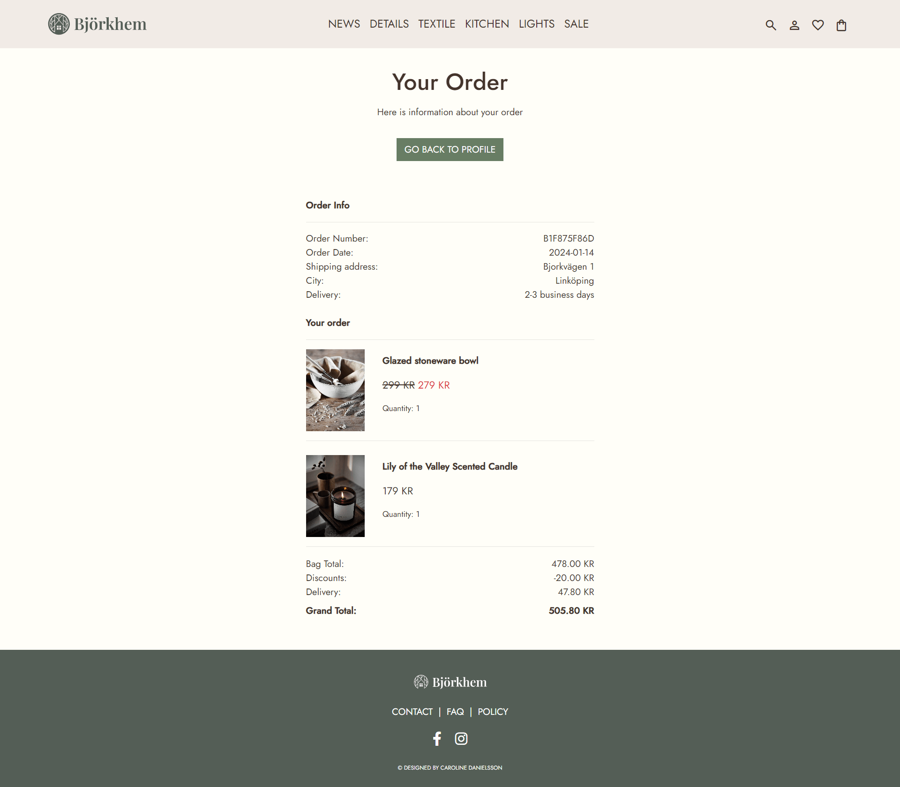

# Björkhem
Link to the website: [Björkhem](https://bjorkhem-8b5ef3ef81a6.herokuapp.com/)

## Table of Content

- [Björkhem](#björkhem)
  - [Table of Content](#table-of-content)
  - [About](#about)
  - [Project Goals](#project-goals)
  - [User Experience - UX](#user-experience---ux)
    - [Strategy](#strategy)
    - [Scope](#scope)
    - [Structure](#structure)
    - [Skeleton](#skeleton)
    - [Surface](#surface)
  - [SEO and Marketing](#seo-and-marketing)  
  - [Agile Development](#agile-development)
    - [Conclusion](#conclusion)
  - [Existing Features](#existing-features)
  - [Future Features](#future-features)
  - [Technologies Used](#technologies-used)
    - [Languages](#languages)
    - [Python Modules \& Packages](#python-modulespackages-used)
    - [Frameworks \& Tools](#frameworks--tools)
  - [Testing and Validation](#testing-and-validation)
  - [Deployment \& Development](#deployment--development)
  - [Credits](#credits)
    - [Media](#media)
    - [Code](#code)

## About

Welcome to Björkhem, explore our collection of cozy Scandinavian home decor for a warm and inviting ambiance. We specialize in countryside-style items to add an extra touch of comfort to your home. Our products are of high quality and come with affordable prices. Easily infuse your space with the charm of Swedish living.

Björkhem is your online destination for genuine Nordic living. Enjoy a straightforward shopping experience, discover discounts, save your favorites, and stay informed with our friendly newsletter. We're passionate about bringing the heart of Scandinavian country-style living to your doorstep.

## Project goals

The webshop project has a primary goal: to offer customers an effortless experience in discovering and purchasing rustic Scandinavian home decor. Users can explore and acquire charming pieces that bring countryside vibes into their homes.

The navigation is designed to be straightforward, featuring exclusive discounts and allowing users to bookmark favorites for seamless purchases. The focus is on simplicity and affordability, providing a welcoming space for everyone to add a touch of comfy living to their spaces.

In essence, this project serves as a digital destination where customers can easily find and purchase affordable and charming home treasures, capturing the essence of Scandinavian country-style living. The goal is to make it easy for individuals to shop and enhance their homes with a cozy feel.

## User Experience – UX

The application was created with a focus on the Five Planes of User Experience.

### Strategy

| Category                   | User Story                                                                                                   | Identifier |
|--------------------------- |--------------------------------------------------------------------------------------------------------------|------------|
| Viewing and Navigation     | As a shopper, I want to effortlessly navigate the website so that I can explore various home decor products.   | 1A         |
|                            | As a shopper, I want to view a list of products available for purchase so I can easily browse, compare, and decide what to buy. | 1B         |
|                            | As a shopper, I want to see specific details about a product so that I can make detailed purchase decisions.   | 1C         |
|                            | As a shopper, I want to easily see discounts and special offers so that I can benefit from cost savings.       | 1D         |
|                            | As a shopper, I want the website to work well on different devices so I can use it easily.                      | 1E         |
| Registration & User Accounts | As a site user, I want to easily register for an account using my email so that I can buy products.               | 2A         |
|                             | As a registered user, I want to access my order history and contact details so that I have control over my account information. | 2B         |
|                             | As a registered user, I want the ability to view a page featuring my favorite products so that I can quickly access and manage them. | 2C         |
|                             | As a registered user, I want to be able to permanently delete my account so that I can have control over my personal information and stop using the platform. | 2E         |
| Sorting & Searching         | As a shopper, I want to quickly find products by using keywords so that I can easily locate the product I'm searching for. | 3A         |
|                             | As a shopper, I want to easily refine my search using filters so that I can easily find what I'm looking for.     | 3B         |
| Purchasing and Checkout     | As a shopper, I want to add products to my cart easily so that I can review and confirm my selections before checkout. | 4A         |
|                             | As a shopper, I want a seamless and secure checkout process so that I can quickly and securely complete my purchases. | 4B         |
|                             | As a shopper, I want details about shipping costs so that I can make informed decisions and improve my overall shopping experience. | 4C         |
|                             | As a shopper, I want the option to review and edit my order details before confirming the purchase so that I can ensure my order is correct. | 4D         |
|                             | As a shopper, I want to receive an order confirmation so that I can have a record of my purchase.                | 4E         |
| Admin and Store Management  | As an admin, I want an easy process to add a product to the webshop so that I can efficiently manage the product catalog. | 5A         |
|                             | As an admin, I want the capability to edit or update product information so that I can easily keep the webshop content up to date. | 5B         | 
|                             | As an admin, I want to delete items from the webshop so that I can keep track of inventory easily.  | 5C        |

### Target Audience

The target audience includes individuals who appreciate Scandinavian country-style home decor, with a particular emphasis on those in Sweden. Catering to those who value the warmth and simplicity of rural Scandinavian design, the focus is on creating a welcoming space. The curated selection of home treasures captures the essence of cozy living, providing a diverse range of options for individuals seeking timeless pieces to enhance their homes. Whether you're setting up your first apartment or adding character to an existing space, embrace the beauty of Scandinavian country-style living, right here in Sweden.

### Personas

**Persona: Sofia, 28**

**Background:**
- A 28-year-old professional residing in Stockholm, Sweden.
- Emma works in a creative field and values a cozy home environment.

**Interests:**
- Passionate about Scandinavian country-style home decor.
- Enjoys exploring vintage markets for unique pieces.

**Needs and Goals:**
- Seeks affordable and charming home decor reflecting a love for rustic design.
- Aims to create a stylish and welcoming home ambiance.

**Challenges:**
- Limited time due to a busy work schedule.
- Faces budget constraints as a young professional.

**How our Platform Helps:**
- Provides a user-friendly experience for easy browsing and product discovery.
- Offers a range of affordable, rustic decor items tailored to Emma's taste.
- Allows for the curation of favorite pieces and convenient access.

Considering Emma's preferences, our platform is designed to cater to individuals like her who appreciate Scandinavian country-style living. We aim to provide a seamless and budget-friendly shopping experience, ensuring the discovery of charming home treasures.

## User Experience and Expectations

* Easy-to-use website with simple navigation.
* Access to all site functions without any hassle.
* Links and features work smoothly.
* Effortless and user-friendly shopping experience.
* Instant feedback when using the website's features.
* A nice-looking design that works well on different devices.
* Accessibility.

### Scope

1. **Intuitive Shopping Experience:**
- Ensure a easily navigable menu for straightforward product discovery.
- Verify that product names and categories accurately represent their content.
- Provide clear visual cues to guide users through the shopping process.
- Design each page with a layout that enhances the presentation of products.

2. **Relevant Product Information:**
- Include detailed information about each product, helping users make informed purchase decisions.
- Showcase featured products on the homepage to give visitors a snapshot of the webshop's offerings.

3. **Core E-Commerce Functions:**
- Develop essential features enabling smooth e-commerce interactions.
- Implement user registration, login, and logout functionalities for a personalized shopping experience.
- Create an efficient product addition form for seamless inventory management.
- Enable features allowing users to manage their shopping carts and track order history.

4. **Search Functionality:**
- Integrate a robust search feature, allowing users to quickly find products based on keywords.

5. **Wishlist Feature:**
- Implement a wishlist functionality, allowing users to save and track products they wish to purchase in the future.
  
6. **Secure Payment Processing:**
- Implement secure and reliable payment gateways to ensure the safety of user transactions.

7. **Responsive Design:**
- Ensure the webshop functions flawlessly on desktops, tablets, and mobile devices.
- Prioritize a responsive design to guarantee a seamless shopping experience across various devices and screen sizes.

### Skeleton

#### Current/Initial Structure

1. **Homepage:**
  - Display featured products for a quick introduction to the webshop's offerings.
  - Provide clear navigation to product categories.

2. **Product Pages:**
  - Organize products within relevant categories.
  - Ensure each product page includes detailed information, pricing, and clear call-to-action.

3. **User Account Section:**
  - Implement user registration, login, and logout functionalities.
  - Enable users to manage their personal information and track order history.
  - Store favorite products on a dedicated page.

4. **Shopping Cart:**
  - Develop a functional shopping cart for users to review and manage selected items.
  - Implement a seamless checkout process.

6. **Community Engagement:**
  - Provide links to social media platforms for community interaction.
  - Add a newsletter signup form.

7. **Contact, About and FAQ:**
  - Include contact information.
  - Include information about the webshop's mission, values, and commitment to quality.
  - Explore our Frequently Asked Questions (FAQs) section for quick answers to common queries and helpful information.

#### Wireframes

I used Figma to design wireframes, which helped me to create a visual representation of the webshop.

**Home page**

Desktop

Mobile view

**Product page**

Desktop

Mobile view

**Product detail page**

Desktop

Mobile view

**My profile**

Desktop

Mobile view

**Bag pag**

Desktop

Mobile view

**Checkout page**

Desktop

Mobile view

**Checkout success page**

Desktop

Mobile view

**Login page**

Desktop

Mobile view

**Sign up page**

Desktop

Mobile view

**Contact, about and FAQ**

Desktop

### Surface

#### Data Base Design
The Entity Relationship Diagram (ERD) shows how the database is organized at the heart of the site's features.

**User Model:** 

Django provides a User Model, which serves as the foundation for user accounts on the platform. Users can register and manage their profiles using this model.

**User Profile Model:**

The User Profile model extends the basic Django User model by adding extra details like full name, phone number, password, and address.

**GDPR Consent Model:**

The GDPR Consent model tracks user consent for GDPR compliance.

**Product Model:**

The Product model holds key information about each product, such as SKU, name, category, color, size, description, image, price, and posting date. It also keeps track of product-related metrics like favorites and related products.

**Category Model:**

The Category model handles different product categories by storing their names and user-friendly identifiers.

**Related Products Model:**

The Related Products model establishes connections between different products. It includes references to the "from_product" and "to_product," indicating related products in the system.

**Order Model:**

The Order model contains details about user orders, including order number, user profile, contact details, delivery information, costs, and timestamps. It also saves the original bag content, payment details, and a unique order identifier.

**Order Line Item Model:**

The Order Line Item model represents individual items within an order, like the associated order, product, quantity, total cost, and purchased quantity. Note that the "purchased quantity" field is currently unused but is intended for future integration with stock management functionality.

**Future Models:**

The **Stock model** is a fundamental component designed to manage future product stock levels. It maintains crucial data, including the unique identifier of the product and the available quantity. This model serves as a foundation for tracking and controlling stock levels in the application's future functionalities.

#### Colours

I aimed to establish a warm and inviting ambiance, opting for earthy tones and subtly muted colors.

#### Typography
I selected the Jost font to improve the visual appeal and readability of the webshop. The aim was to create a text style that is both pleasant and easy to read, harmonizing seamlessly with the overall design.

#### Logo
I created a simple logo for Björhem to strengthen its visual identity. The logo is minimalistic and easy to understand, making it easier for users to recognize and associate with Björkhem.

## SEO and Marketing
The SEO and Marketing documentation can be found at [MARKETING.md](MARKETING.md).

## Agile Development
The development of this project was managed through GitHub issues, milestones, and projects.
[Link to Björkhem User Stories](https://github.com/users/cardan22/projects/5)

### Sprints
The project adopted an Agile development approach, breaking down the development process into several sprints. Each sprint had a specific focus and objectives:

**Sprint 1: Initial Project Setup and Core Features (Dec 1 - Dec 12, 2023)**

The first sprint concentrated on setting up the initial structure of the Björkhem project. This involved foundational work such as configuring navigation, styling templates, and ensuring mobile responsiveness. Additionally, the core features of product display and details were implemented.

**Sprint 2: E-commerce Functionality (Dec 13 - Dec 20, 2023)**

During the second sprint, the focus shifted to implementing e-commerce functionality. This included the development of the checkout process, integration with Stripe for payment, and the addition of features like quantity adjustments and discounts.

**Sprint 3: Cart Management, Search, and User Profiles (Dec 21 - Dec 28, 2023)**

Sprint 3 delved into refining the shopping experience by introducing cart management functionalities, including bag previews and toasts for user notifications. The search feature and category filtering were implemented to enhance product discoverability. User profiles and GDPR-related features were also incorporated.

**Sprint 4: Styling Refinements and Newsletter Features (Dec 29, 2023 - Jan 5, 2024)**

The fourth sprint focused on refining the overall styling and user interface. This included improvements to CSS, buttons, and the newsletter form. Stylish updates were made to the checkout and bag templates for a more polished appearance.

**Sprint 5: Testing, Final Code Revisions, and Documentation (Jan 6 - Jan 15, 2024)**

The final sprint concentrated on comprehensive code testing and final revisions. The project documentation underwent finalization, and detailed adjustments were made to guarantee the overall quality and thoroughness of the project.

## Conclusion

The systematic breakdown of the development process into sprints has been pivotal in achieving the goals of the Björkhem project. Each sprint contributed to the project's evolution, ensuring that it aligns with its main objectives. This organized approach has not only made development smoother but also ensured that every aspect of the project is well-crafted and in line with its overarching vision.

## Features

### Existing Features

#### Header and logo
* The section displays a logo along with the header text.
* Helps the user to quickly recognize and connect the website with its specific content and purpose.
* Different links are shown to users depending on whether they are logged in or not. 
* On smaller screens, the navigation links become a collapsible burger menu for a user-friendly experience.

Default navbar and header for unregistered user

Mobile - Navbar and header for unregistered user

Navbar and header for registered user

Mobile - Navbar and header for registered user

#### Footer section
* The footer includes links to Instagram and Facebook, along with a copyright feature.

Footer

#### Account Features

##### Create an Account
* Allows User Signup
* Fields: Username, Email, Password, Password Confirmation

Sign up

##### Login to an Account
* Allows User Access to their profile page

Login

##### Log Out of an Account
* Allows User to Log Out

Logout

##### Password reset
* Allows User to reset password

Password reset

Password reset confirmation

Password changed

### Main Views

#### Home Page
* Visitors are greeted with an attractive hero image and an enticing call-to-action prompting them to 'Shop now.'
* The homepage showcases a paginated list of the four most recent news items.
* Logged-in users can spot a heart icon in the navbar, where all products they have marked with a heart are gathered.
* Users also have the option to sign up for the newsletter.

Home page

#### Products
* Visitors can select a category in the navigation to view a list of products within that category.
* The products are displayed with images, names, regular prices, and, if available, discounted prices.

Product page

#### Product detail
* Clear product presentation with images, name, and description.
* Convenient purchase options, including price details and "Add to Cart" button.
* User-friendly features like quantity selection and favoriting for logged-in users.
* Related products are displayed below to provide more inspiration if available.

Product detail page

#### Bag

* Easily view, adjust, and remove items in the shopping bag.
* Get a detailed cost summary, including product costs, discounts, shipping charges, and the total.
* Receive notifications on free shipping eligibility progress or qualification.
* Effortlessly proceed to checkout to complete the purchase.

Bag page

#### Checkout

* Users view a detailed order summary, listing selected products and total cost.
* Input contact and credit card details.
* Finalize the order by clicking "Complete Order."

Checkout page

#### Checkout Success

* Receive a detailed order confirmation and a confirmation email with all relevant order information.

Checkout success page

Email confirmation mail

#### My profile

* View order history, if available.
* Access and update contact information, including GDPR-related fields.

My profile

#### Favorite page

* Logged-in users have the ability to save favorites by clicking on the heart icon in the products.
* All favorites are gathered on the page; if a user has no favorites, a message encourages them to add items to their favorites.

Favorite page

#### Product Management

* Superusers have access to product management features.
* Edit and delete buttons are visible on all products for superusers.
* Superusers can add new products and edit existing ones.

Add product

Edit product

Product Management links - edit/delete

#### Newsletter

* The newsletter form is strategically placed and visible on select pages for easy sign-up accessibility.

Newsletter form

#### Searchfield

* The search field is conveniently integrated as a toggle button in the navbar, allowing users to easily search for products.

Searchfield

#### Sorting

* Users have the option to sort products on the product page based on price or name.

Sorting

#### Toast messages

* Users receive informative toast messages for various actions, such as adding a product, liking an item, attempting to access restricted pages, or encountering other relevant notifications.

Success message

Success message - add to bag

Error message

Alert message

#### 404 view
* The 404 view is designed to provide a user-friendly error page in case a requested page is not found on the website.
* This page offers a visually appealing and informative 404 error message, helping users navigate back to the site's functional pages.

404 page

## Future Features

**Additional Product Images:**

Improve user experience by adding more images for each product, giving customers a detailed view of the item.

**Delete Account**

User empowerment is a core principle at Bjorkhem. Therefore, a "Delete Account" option will be offered, allowing users to have control over their accounts. This feature will enable individuals to remove their profiles and associated data at any time, providing a flexible and secure user experience.

**Stock Management**

In the future, superusers will be able to control stock, and regular users will also receive information if a product is running low or out of stock.

## Technologies Used

### Languages

* [HTML](https://en.wikipedia.org/wiki/HTML)
* [CSS](https://en.wikipedia.org/wiki/Cascading_Style_Sheets)
* [JavaScript](https://en.wikipedia.org/wiki/Javascript)
* [Python](https://en.wikipedia.org/wiki/Python_%28programming_language%29)

### Python Modules/Packages used

## Project Dependencies

- **asgiref:** ASGI specification reference implementation, used for handling asynchronous requests in Django.
- **boto3:** A Python library providing an interface to Amazon Web Services (AWS), allowing seamless integration with AWS services.
- **botocore:** Low-level, core functionality for AWS services, often used in conjunction with boto3.
- **coverage:** Measures code coverage during test execution.
- **dj-database-url:** A Django utility for parsing database connection URLs.
- **Django:** A high-level Python web framework for building web applications.
- **django-allauth:** A comprehensive suite of Django applications addressing user authentication, registration, account management, and third-party (social) account authentication.
- **django-bootstrap4:** Provides template tags and filters to integrate Bootstrap 4 components directly into Django templates.
- **django-crispy-forms:** Enhances the rendering of Django forms, offering more control and elegance in form presentation.
- **django-storages:** A Django library to manage storage backends like Amazon S3 and others.
- **gunicorn:** A Python WSGI HTTP Server for UNIX, used to serve Django applications.
- **jmespath:** Used for querying JSON-like data structures.
- **oauthlib:** Provides support for OAuth1 and OAuth2.
- **Pillow:** A powerful Python imaging library that adds support for opening, manipulating, and saving many different image file formats.
- **psycopg2:** A PostgreSQL database adapter for Python, enabling seamless interaction with the database.
- **PyJWT:** Enables working with JSON Web Tokens (JWT).
- **python3-openid:** A set of Python packages to support the use of the OpenID decentralized identity system.
- **requests-oauthlib:** An OAuthlib extension to work with requests.
- **s3transfer:** Used for managing Amazon S3 transfers.
- **sqlparse:** A non-validating SQL parser.
- **stripe:** A Python library for interacting with the Stripe API.
- **urllib3:** A powerful HTTP client for Python.

### Frameworks & Tools

* **Django:** Utilized for building the website's backend logic and user model.
* **Gitpod:** Used for writing, developing, committing, and pushing code to the GitHub repository.
* **Heroku:** Employed for deploying the live version of the website.
* **GitHub:** Hosts the website's source code and serves as a platform for Agile development framework management through issues, milestones, and projects.
* **Bootstrap:** Applied across the site to ensure responsiveness, establish layout, and utilize predefined style elements.
* **Figma:** Utilized for creating wireframes and project design.
* **drawSQL:** Employed for designing the Entity-Relationship Diagram (ERD).
* **Google Fonts & Icons:** Imported custom fonts and integrated some icons into the website's design and functionality.

## Testing and Validation
The testing documentation can be found at [TESTING.md](TESTING.md)

## Deployment & Development

### Deploy on Heroku

**To deploy your project on Heroku, follow these steps:**

**Step 1: Preparing Files**

Before you start, you need two essential files: `requirements.txt` and `Procfile`.

- Create `requirements.txt` by running this command in your terminal: `pip3 freeze --local > requirements.txt`. This file will list all the requirements.
- Next, create a file named `Procfile` and add the line: `web: gunicorn bjorkhem.wsgi` to it, without any empty lines. Make sure to push both these files to your repository.

**Step 2: Creating a Heroku App**

1. Log in to Heroku and go to the Dashboard.
2. Click "New" and select "Create new app."
3. Give your app a name and choose the region closest to you.
4. Click "Create app" to confirm.

**Step 3: Setting Up a Database**

1. Log in to ElephantSQL.com and access your dashboard.
2. Click "Create New Instance."
3. Choose a plan, give it a name, select the Tiny Turtel (Free) plan, and leave the Tags field blank.
4. Select a data center near you and confirm your details.
5. Return to the ElephantSQL dashboard, click on the database instance name for your project.
6. In the URL section, copy the database URL.
7. Install necessary packages using:
* `pip3 install 'django<4' gunicorn dj_database_url===0.5.0 psycopg2 psycopg2-binary`
8.  Update the `requirements.txt` file if necessary.

**Step 4: The env.py File**

1. Create an `env.py` file if you don't have one and include it in the `.gitignore` file.
2. Add the following lines to env.py:

* `import os`  
* `os.environ["DATABASE_URL"] = "<copied URL from SQL database>"`  
* `os.environ["SECRET_KEY"] = "<create a secret key of your own>"`  

Ensure that the environment variables are correctly imported into the `settings.py` file.

**Step 5: Configuring S3 Storage for Media Files**

1. Sign up for an Amazon S3 account if you haven't.
2. Create a new S3 bucket for storing media files.
3. Obtain your AWS access key and secret key.
4. Add the following lines to your `env.py` file:
* `os.environ["AWS_ACCESS_KEY_ID"] = "<your AWS access key>"`
* `os.environ["AWS_SECRET_ACCESS_KEY"] = "<your AWS secret key>"`

5. Install the required package:
* `pip install django-storages==1.14.2`

6. Add the following configuration to `settings.py`:
* `AWS_STORAGE_BUCKET_NAME = '<bucket name>'`
* `AWS_S3_REGION_NAME = '<region name>'`
* `AWS_ACCESS_KEY_ID = os.environ.get('AWS_ACCESS_KEY_ID')`
* `AWS_SECRET_ACCESS_KEY = os.environ.get('AWS_SECRET_ACCESS_KEY')`
* `AWS_S3_CUSTOM_DOMAIN = f'{AWS_STORAGE_BUCKET_NAME}.s3.amazonaws.com'`

7. Update the `MEDIA_URL` and `DEFAULT_FILE_STORAGE`:
* `MEDIA_URL = f'https://{AWS_S3_CUSTOM_DOMAIN}/'`
* `DEFAULT_FILE_STORAGE = 'storages.backends.s3boto3.S3Boto3Storage'`

**Step 6: Setting Up Stripe for Payment Processing**

1. Log in to your Stripe Dashboard or create an account.
2. Navigate to "Developers" > "API keys."
3. Copy the "Publishable key" and "Secret key."
4. Add the following lines to your `env.py` file:
* `os.environ["STRIPE_PUBLIC_KEY"] = "<your Stripe Publishable key>"`
* `os.environ["STRIPE_SECRET_KEY"] = "<your Stripe Secret key>"`
* `os.environ["STRIPE_WH_SECRET"] = "<your Stripe Webhook Secret key>"`

5. Make sure to include the `STRIPE_PUBLIC_KEY` and `STRIPE_SECRET_KEY` in your `settings.py` file.
6. Install required package:
* `pip3 install stripe==7.10.0`
7. Update the `requirements.txt` file by using `pip freeze > requirements.txt`

**Step 7: Setting Environment Variables on Heroku**

1. On the Heroku Dashboard, select the app you created and go to the "Settings" tab.
2. Click "Reveal Config Vars."
3. Add the following config vars:
* `DATABASE_URL` (copy the database URL from ElephantSQL).
* `SECRET_KEY` (copy your secret key).
* `AWS_ACCESS_KEY_ID` (copy your secret key).
* `AWS_SECRET_ACCESS_KEY` (copy your secret key).
* `STRIPE_PUBLIC_KEY`(copy your key).
* `STRIPE_SECRET_KEY`(copy your secret key).
* `STRIPE_WH_SECRET` (copy your wh secret key).

**Step 8: Connecting to GitHub and Deployment**

1. On the Heroku Dashboard, select your app and go to the "Deploy" tab.
2. Choose GitHub as the deployment method.
3. Search for your project repository and click "Connect."
4. If desired, enable automatic deploys.
5. Finally, select "Deploy Branch" to watch your app being built and deployed.

### Forking the Repository

1. Log in to GitHub and find the repository you want to fork.
2. Above the "Settings" Tab, click the "Fork" button.
3. You now have a copy of the original repository in your GitHub account, allowing you to make changes while keeping the original safe.

### Making a Local Clone

1. Log in to GitHub and locate the repository you want to clone.
2. Click the 'Code' dropdown above the file list.
3. Copy the URL for the repository.
4. Open Git Bash in your IDE.
5. Change the current working directory to where you want the cloned directory.
6. Type `git clone` in the CLI and then paste the URL you copied. It should look like this: `$ git clone https://github.com/yourusername/yourrepository`
7. Press Enter to create your local clone.
8. Don't forget to install all the required packages listed in the `requirements.txt` file using the command: `pip install -r requirements.txt`.

**Link to:** [Bjorkhem Repository](https://github.com/cardan22/bjorkhem)

## Credits

### Media

**Images:**

Hero image:

* [Hero Image](https://www.flickr.com/photos/147283126@N07/52960973427/in/album-72177720308927262/)

404 image:

* [404 Page Image](https://www.flickr.com/photos/147283126@N07/52549266474/in/album-72177720304296538/)

Facebook page:

* [Facebook profile background](https://www.flickr.com/photos/147283126@N07/52401695601/in/album-72177720299753640/)
* [Facebook profile picture](https://unsplash.com/photos/woman-in-black-long-sleeve-shirt-sitting-on-white-couch-n1B6ftPB5Eg)
* [Mockup](https://www.figma.com/community/file/1136232663200778614)
* [Facebook post](https://www.flickr.com/photos/147283126@N07/53234324170/in/album-72177720309082098/)

Product Images:

* [Angshult vase](https://www.storefactory.se/en/product/angshult-2/)
* [Ektorp](https://www.storefactory.se/en/product/ektorp/)
* [Elsa](https://www.storefactory.se/en/product/elsa/)
* [Flora 12](https://www.storefactory.se/en/product/flora-12/)
* [Lundby](https://www.storefactory.se/en/product/lundby/)
* [Candle Holder](https://ernstform.se/produkter/ljus-ljuslyktor/350125/)
* [Apron](https://ernstform.se/produkter/kok/112025/)
* [Candle Holder](https://ernstform.se/produkter/ljus-ljuslyktor/264415/)
* [Textiles](https://ernstform.se/products/textiles/117430/)
* [Baking dish](https://ernstform.se/produkter/kok/248205/)
* [Vase](https://ernstform.se/products/vases-pots/270751/)
* [Candles & Candle Holders](https://ernstform.se/products/candles-candle-holders/350125/)
* [Candle Holders](https://ernstform.se/products/candles-candle-holders/ektl53/)
* [Cushions](https://ernstform.se/products/cushions/111731/)
* [Cushion Cover](https://ernstform.se/produkter/textilier/113344/)
* [Cushions](https://ernstform.se/produkter/textilier/113313/)
* [Glases](https://ernstform.se/produkter/kok/245010/)
* [Bowl](https://ernstform.se/products/kitchen/246016/)
* [Vase](https://ernstform.se/produkter/vaser-krukor/glasvas-3/)
* [Tea](https://ernstform.se/produkter/ernst-skafferi/320303/)

### Code

I drew resources and inspiration from a few different places:
- Reviewed Code Institute's 'I Think Therefore I Blog' and 'Boutique Ado' walkthrough project as references to start the coding process

- Some previous projects were helpful:
  - [earthalchemy-naturals](https://github.com/Lilla-Kavecsanszki/EarthAlchemyNaturals/tree/main) by Lilla Kavecsanszki
  - [chirpy-chooks](https://github.com/Kay-ddggxh/chirpy_chooks) by Kay-ddggxh

- During the project, I frequently visited the following websites for troubleshooting and assistance:
  - [Stack Overflow](https://stackoverflow.com/)
  - [W3 Schools](https://www.w3schools.com/)
  - [Bootstrap](https://getbootstrap.com/)

[Back to top](#björkhem)