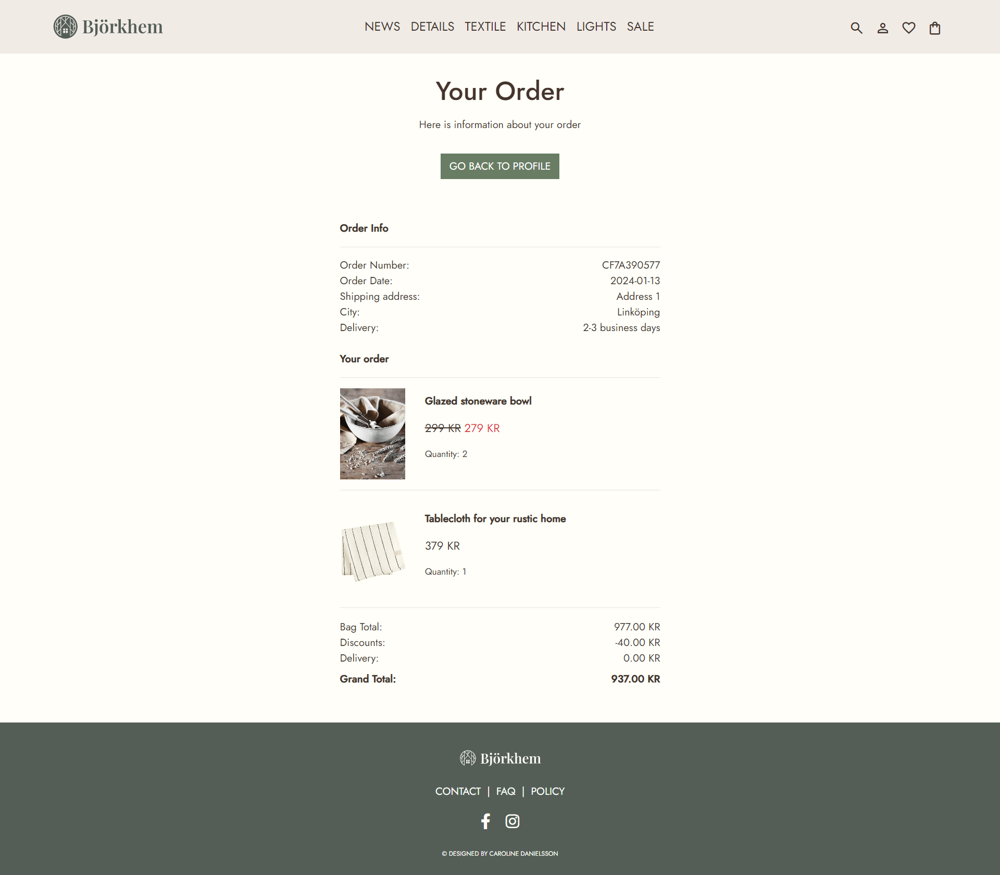

# Björkhem Testing

:arrow_left: [Return to the README](README.md)

## Table of Contents

- [Performance](#performance)
- [Accessibility](#accessibility)
- [Code Validation](#code-validation)
  - [HTML Validation](#html-validation)
  - [CSS Validation](#css-validation)
  - [JS Validation](#js-validation)
  - [Python Validation](#python-validation)
- [Testing](#testing)
  - [Manual Testing](#manual-testing)
  - [Automated Testing](#automated-testing)
- [Stripe Testing](#stripe-integration-testing)
- [Browser Testing](#browser-testing)
- [Bugs & Fixes](#bugs-and-fixes)

# Performance
[Google Lighthouse](https://chrome.google.com/webstore/detail/lighthouse/blipmdconlkpinefehnmjammfjpmpbjk?hl=en) was used to test the performance of the website. The website's performance received relatively lower scores, primarily due to its extensive use of images. However, the accessibility, adherence to best practices, and SEO aspects consistently received high scores.

**Google Lighthouse results:**

Desktop

Mobile

# Accessibility
[The WAVE WebAIM](https://wave.webaim.org) web accessibility evaluation tool to check if the website meets strong accessibility standards.
As a result, I've identified several areas where I can work on improving the website's accessibility. Specifically, there are some contrast errors related to buttons that need enhancements to improve color contrast. Additionally, there are issues related to alerts, where links lead to the same page. These areas need my attention to make the website more user-friendly and accessible, ensuring a better experience for all visitors.

**Wave results:**

Home page

# Code validation

## HTML Validation
The [W3C Markup Validation Service](https://validator.w3.org/) was used to validate the HTML of the website.

**HTML results:**

The following pages have been tested, and no errors were detected on any of them. However, an informational message (info) was encountered, which does not indicate an error but provides information about the HTML structure on certain pages. The message pertains to the use of trailing slashes on void elements.

Home page

Products page

Product detail page

News page

Details page

Textile page

Kitchen page

Lights page

Sale page

Checkout page

Checkout success page

Login page

Sign up page

Logout page

Product Management: Add product page

Product Management: Edit product page

My profile

Order history

Favorite products page

Contact page

Policy page

## CSS Validation
The [W3C Jigsaw CSS Validation Service](https://jigsaw.w3.org/css-validator/) was used to validate the CSS of the website.

**CSS results:**

The CSS was tested, and no errors were found.

base.css

checkout.css

## JS Validation
[JSHint](https://jshint.com/) was used to validate the JavaScript of the website

**JS results:**

The JS was tested, and no errors were found.

JS base template

JS bag template

JS Stripe element

JS Product management page: Add/Edit product

JS Newsletter

## Python validation
The Python code was tested using [Flake8](https://flake8.pycqa.org/en/latest/).
I have tested the code using flake8 and encountered no errors. However, I do receive some information indicating that some items are imported but unused.

Flake8 result

# Testing

## Manual testing
BDD, or Behaviour Driven Development, is the process used to test user stories in a non-technical way, allowing anyone to test the features of an app.

**EPIC: Content and navigation**

| ID  | User Story | Action/Expected Results | PASS |
| --- | -----------| ------------------------ | ---- |
| 1A  | As a shopper, I want to effortlessly navigate the website so that I can explore various home decor products. | Visitors to the site can utilize a navigation menu, featuring a prominent "Shop Now" call-to-action button on the home page for accessing all available products. Additionally, four featured news products are showcased. The header's navigation bar includes links to essential pages, and for mobile or small screens, a burger menu icon is displayed, offering convenient access to various pages. | &#x2611; |
| 1B  | As a shopper, I want to view a list of products I can buy so I can easily look around, compare them, and decide what to buy. | Shoppers can check out a list of products available for purchase, making it easy to explore, compare, and decide on their purchases. The navigation menu organizes products into different categories, simplifying the search for what you're looking for. | &#x2611; |
| 1C  | As a shopper, I can see specific details about a product so that I can make detailed purchase decisions. | Shoppers can access the product detail page, featuring images, title, price, description, and, if applicable, details on color or size. The page includes an "Add to Cart" call-to-action button and provides information about free shipping and return policies. Additionally, shoppers can explore related products, if available. | &#x2611; |
| 1D  | As a shopper, I can easily see discounts and special offers so that I can benefit from cost savings. | Clear indications of discounted prices are provided, with the original price struck through and the new discounted price prominently displayed in red, ensuring easy identification of sale items. | &#x2611; |
| 1E  | As a shopper, I want the website to work well on different devices so I can use it easily. | The website is designed to look and function seamlessly on all devices, ensuring a user-friendly experience. | &#x2611; |

**EPIC: Registration & User Accounts**

| ID  | User Story | Action/Expected Results | PASS |
| --- | -----------| ------------------------ | ---- |
| 2A  | As a site user, I want to easily register for an account using my email so that I can buy products. | Unregistered users can find a 'Register' link in the navigation bar. Clicking on this link opens a new page, providing users with the opportunity to create an account using their email address. | &#x2611; |
| 2B  | As a registered user, I want to access my order history and contact details so that I have control over my account information. | Registered users can find a 'My Profile' link in the navbar for easy access, where users can view order history and contact information, along with managing GDPR consent.  | &#x2611; |
| 2C  | As a registered user, I want the ability to view a page featuring my favorite products so that I can quickly access and manage them. | As a registered user, accessing the 'Favorites' page in the navbar through the heart icon allows for the convenient storage of all liked items on this page, enabling quick access and management. | &#x2611; |

**EPIC: Sorting & Searching**

| ID  | User Story | Action/Expected Results | PASS |
| --- | -----------| ------------------------ | ---- |
| 3A  | As a shopper, I want to quickly find products by using keywords so that I can easily locate the product I'm searching for. | In the navbar, there is a search symbol. Clicking on it reveals a search field where users can enter keywords to search for products and easily find what they are looking for.| &#x2611; |
| 3B  | As a shopper, I want to easily refine my search using filters so that I can easily find what I'm looking for. | Shoppers can find a sorting function on the products page, allowing them to sort products by name or price for easier navigation and discovery. | &#x2611; |

**EPIC: Purchasing and Checkout**

| ID  | User Story | Action/Expected Results | PASS |
| --- | -----------| ------------------------ | ---- |
| 4A  | As a shopper, I want to add products to my cart easily so that I can review and confirm my selections before checkout. | licking on "Add to Cart" triggers a confirmation message, and the product is placed in the shopping bag for later review and confirmation. | &#x2611; |
| 4B  | As a shopper, I want a seamless and secure checkout process so that I can quickly and securely complete my purchases. | Shoppers should experience a seamless and secure checkout process for quick and secure purchases.  | &#x2611; |
| 4C  | As a shopper, I want details about shipping costs so that I can make informed decisions and improve my overall shopping experience. | Shoppers receive a message indicating whether they qualify for free shipping or how much more they need to spend to qualify. If free shipping is not applicable, the shopping bag displays the calculated shipping cost. | &#x2611; |
| 4D  | As a shopper, I want the option to review and edit my order details before confirming the purchase so that I can ensure my order is correct. | Shoppers have the ability to review and edit order details before the final confirmation. This includes the option to increase or decrease the quantity of a product or remove a product from the shopping bag. | &#x2611; |
| 4E  | As a shopper, I want to receive an order confirmation so that I can have a record of my purchase. | After completing the purchase, shoppers are directed to a confirmation success page, and they also receive an email containing the order details. | &#x2611; |

**EPIC: Admin and Store Management**

| ID  | User Story | Action/Expected Results | PASS |
| --- | -----------| ------------------------ | ---- |
| 5A  | As an admin, I want an easy process to add a product to the webshop so that I can efficiently manage the product catalog. | When logged in as a superuser, access to the product management section is provided. A straightforward form is available to easily upload new product information.  | &#x2611; |
| 5B  | As an admin, I want the capability to edit or update product information so that I can easily keep the webshop content up to date. | Superusers can see edit/delete links on all products for easy management and updating of product information. | &#x2611; |
| 5C  | As an admin, I want to delete items from the webshop so that I can keep track of inventory easily. | As a superuser, I can use the delete button to easily remove products and keep track of inventory. | &#x2611; |

# Automated Testing

**Testing results:**

Home views

Products views

Products Models

Bag Views

Profiles Views

Profiles Models

Profiles Forms

**Testing coverage:**

To achieve an even higher percentage, additional tests need to be conducted, particularly for the checkout app. A coverage report was generated to evaluate the code test coverage percentage.

Coverage report

# Stripe Integration Testing

The Stripe integration underwent testing to ensure a seamless payment processing experience. The application was verified to handle Stripe notifications accurately, ensuring precise updates to orders and other essential information. The Stripe payment was confirmed to align with the order confirmation displayed below.

Order confirmation

Stripe Webhook Confirmation

# Browser Testing

- Chrome
- Safari
- Microsoft Edge

# Bugs and Fixes

| Bug ID | Bug Description | Fix Description |
| ------ | --------------- | --------------- |
| #1     | Get 403 error when trying to login to admin. | Implemented the following solution in the settings: `CSRF_TRUSTED_ORIGINS = ['https://gitpod.io/*']` |
| #2     | Can't delete `purchased_quantity` field in `OrderLineItem`. | Currently investigating the issue and working on a fix. |
| #3     | Unable to see the link to the image in the form for uploading a product. | Investigation ongoing, fix not implemented yet. |
